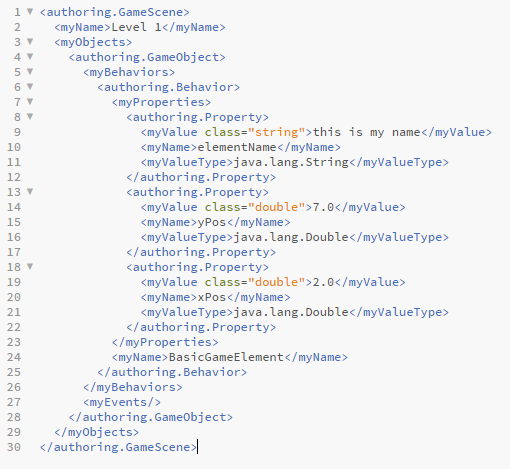
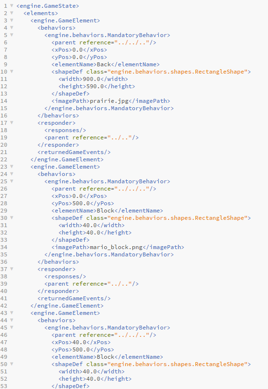

## Display midpoint demo

Each sub-team should present its high level design, including a brief overview describing the design's primary architecture and goals and specifics about how each part works together and what is closed to modification, but open to allowing a variety of extensions to be implemented (specific algorithms or other implementation decisions should not be presented). It must be clear what each sub-team plans to implement and what you expect others to implement to use your design (e.g., game designers or future maintainers of the project). Your sub-team will sound better if it can describe trade-offs you considered during your design meetings.

Each sub-team must present a working demo that shows you have completed the fundamental core of your design. In general, you can best demonstrate your design by showing examples of how it will be used (either with a simple game, GUI component, or example test code). Included in your example code should be data files that drive your code. Thus, I suggest your presentation be driven by example code you have written to test it, even if they are not quite working yet. Your team will look better if it can demo a program that shows sub-teams projects working together.


### High level design
* Goal is to allow Game Authoring to save their game templates to XML
* Allow Game Authoring and Game Engine to load these XML game templates.
* Allow Game Engine to save and load save states to and from a save XML file. 
* Pass information about Games for Game Player GUI
* Keep Game Authoring and Game Engine separate, so there is no need for them to pass data between each other.
* Help with data access, ex images. 
* Manage data file hierarchy/organization.


## Image Manager API

This util is used to create JavaFX images from the string name of the image within a specific game, used in game authoring and game engine. It manages filepath and accessing the images.

```java 
public class ImageManager {

    /**
    * Constructor
    * @param gameName name of game to load and store images from
    */
    public ImageManager(String gameName){}


    /**
     * Retrieves an FX Image from images folder of a game
     * @param imageName name of image desired
     * @return Java FX Image
     */
    public Image getImage(String imageName){}

    /**
     * Stores a Java FX Image into game's image folder as BufferedImage
     * @param imageName desired name of image
     * @param image to be stored
     */
    public void storeImage(String imageName, Image image){}


}


```
## Images
This is how a serialized Game Authoring file (GameScene class) looks like.



This is how a serialized Game Engine file (GameState class) looks like. This XML file can easily be over 1000 lines long.



The Data filepath hiearchy. Each game corresponds to its own named folder, and each game will have descriptions, images, saves, and scenes, which is used by authoring, engine, and playing.


## Notes
Design is limited by XStream since we are still trying to redefine how we want to structure the game files, so it is not very closed, but flexible, as it is very easy to extend for new requirement from , and add new serializers/managers for new desired functionality. 

GameData has no information about front end implementation, as we tried to isolate the functionality of this component as much as possible.


XStream cannot serialize JavaFX objects, so all other sub-teams have to design classes around this limitation.
* For each type of item that is to be serialized, we must create new methods within Gamesaver, Serializer, Deserializer, and Gameloader. This is important to note, since game data is built upon agreed naming conventions within the file hierarchy which must be expanded upon when we make game files more 
complex. 

Tradeoffs:

Currently, we do not have the capability to serialize any type of object. At the same time, however, this allows us to exercise more advanced error checking and helps us maintain a uniform game data structure.
    * throw informative errors for front end notifications
    * dynamic saving for every time step
    * help with standardizing object save format

In our current model, the Serializer class is isolated from the other game components, and is only accessed through another game data class Gamesaver. As a result, this gives the Game Engine and Game Authoring much less freedom in how they can save their data, but we felt as it encapsulating the Serializer within the Gamesaver helped limit the implementation details in a way that would be more beneficial overall. It also reduces the amount of filepath management they need to keep track of.